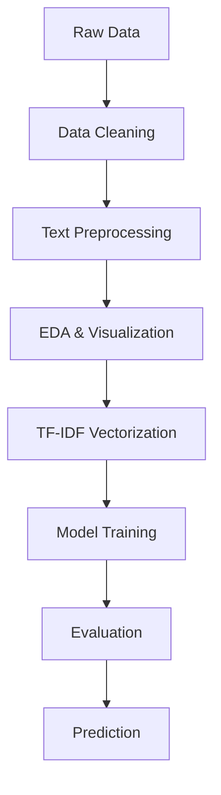

# 🎯 Sentiment Analysis on Alexa Reviews


---

## 🧠 Overview

Analyze Amazon Alexa reviews and classify them as **Positive 😊** or **Negative 😡** using NLP & Machine Learning.

---

## ✨ Features

✔️ Text preprocessing (cleaning, stopwords, stemming)
✔️ Exploratory Data Analysis (EDA) 📊
✔️ TF-IDF vectorization
✔️ Model training (Logistic Regression / Naive Bayes)
✔️ Confusion Matrix & evaluation
✔️ Real-time sentiment prediction

---

## 📂 Dataset

* 📝 `verified_reviews` → Review text
* 👍 `feedback` → Sentiment (1 = Positive, 0 = Negative)
* ⭐ `rating`, 📅 `date`, 🎧 `variation`

---

## ⚙️ Workflow



---

## 🛠️ Tech Stack

* 🐍 Python
* 📊 Pandas, NumPy
* 🤖 Scikit-learn
* 🧹 NLTK
* 📈 Seaborn, Matplotlib
* ☁️ WordCloud

---

## 📊 Sample Output

| Review                              | Prediction  |
| ----------------------------------- | ----------- |
| "Amazing product, works perfectly!" | Positive 😊 |
| "Waste of money, not working"       | Negative 😡 |

---

## 🚀 Run Locally

```bash
git clone <your-repo-link>
cd sentiment-analysis
pip install -r requirements.txt
jupyter notebook
```

---

## 📈 Results

* High accuracy on test data
* Clear separation of positive & negative sentiments
* Insights from WordCloud & visualizations

---

## 🔮 Future Improvements

🚀 Add Neutral sentiment
🚀 Use Deep Learning (LSTM, BERT)
🚀 Deploy as a web app

---

## 🙌 Acknowledgements

Dataset: Amazon Alexa Reviews
Libraries: Scikit-learn, NLTK, Pandas

---

## ⭐ Show Some Love

If you like this project, consider giving it a ⭐ on GitHub!
